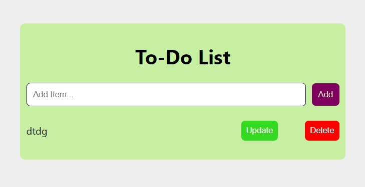

# TaskTrack App

TaskTrack is a sophisticated task management web application developed by Maranatha Adesanya using the MERN (MongoDB, Express.js, React, Node.js) stack. This app is designed to help individuals and teams streamline their task tracking and project management processes efficiently. TaskTrack provides a user-friendly interface for creating, organizing, and tracking tasks with ease.

## Table of Contents

- [Features](#features)
- [Installation](#installation)
- [Usage](#usage)
- [Technologies Used](#technologies-used)
- [Contributing](#contributing)
- [License](#license)

## Features

TaskTrack will offer a comprehensive set of features to simplify your task management:

1. **User Authentication**: Secure user registration and login using JWT (JSON Web Tokens) for access control.
2. **Task Creation**: Easily create tasks with detailed descriptions and deadlines.
3. **Task Organization**: Categorize tasks into projects, assign them to team members, and set priorities.
4. **Task Status Tracking**: Keep track of task progress with customizable status labels (e.g., To-Do, In Progress, Completed).
5. **Task Filtering**: Filter tasks based on various criteria such as status, priority, due date, and more.
6. **Notifications**: Receive notifications for task assignments, deadline reminders, and updates.
7. **Team Collaboration**: Collaborate with team members by assigning and sharing tasks within the app.
8. **User Profile Management**: Edit your profile, change passwords, and update personal information.
9. **Responsive Design**: TaskTrack is fully responsive and optimized for both desktop and mobile devices.

## Installation

Follow these steps to set up TaskTrack on your local machine:

1. **Clone the Repository**:
   ```
   git clone https://github.com/maranathaadesanya/tasktrack.git
   ```

2. **Install Dependencies**:
   Navigate to the project directory and run the following command to install backend dependencies:
   ```
   cd tasktrack
   npm install
   ```

   Then, navigate to the client directory and install frontend dependencies:
   ```
   cd client
   npm install
   ```

3. **Database Configuration**:
   - Create a MongoDB Atlas cluster or set up a local MongoDB instance.
   - Configure your database connection by creating a `.env` file in the project root and adding your MongoDB URI:
     ```
     MONGODB_URI=your-mongodb-uri
     ```

4. **Start the Application**:
   - Start the backend server (from the project root directory):
     ```
     npm start
     ```
   - Start the React development server (from the client directory):
     ```
     npm start
     ```

5. **Access the Application**:
   Open your web browser and visit `https://tasktracc.netlify.app/` to access TaskTrack.

## Usage

1. **User Registration**:
   - Create a new account by clicking the "Register" button and providing your details.

2. **User Login**:
   - Log in with your registered credentials.

3. **Create Tasks**:
   - Click the "Create Task" button to add a new task.
   - Fill in task details, including title, description, deadline, and assignee.

4. **Task Management**:
   - Organize and track tasks in the "Dashboard" by setting statuses, priorities, and project assignments.

5. **Collaboration**:
   - Collaborate with team members by assigning tasks and sharing project updates.

6. **Profile Settings**:
   - Edit your user profile, change your password, and update personal information.

## Technologies Used

TaskTrack is built using the following technologies:

- **Frontend**:
  - React: A JavaScript library for building user interfaces.
  - Cors: A state management library for managing application state.
  - Axios: A promise-based HTTP client for making API requests.

- **Backend**:
  - Node.js: A JavaScript runtime for server-side development.
  - Express.js: A web application framework for building RESTful APIs.
  - MongoDB: A NoSQL database for storing task and user data.
  - JWT (JSON Web Tokens): Used for user authentication and authorization.

- **Authentication**:
  - Passport.js: A middleware for handling user authentication strategies.

- **Styling**:
  - CSS Modules: Scoped styling for React components.
  - Bootstrap: A popular CSS framework for responsive design.

- **Deployment**:
  - Deployment options include Heroku, AWS, or any other hosting provider of your choice.

## Contributing

We welcome contributions from the open-source community. To contribute to TaskTrack in order to build these features, please follow these steps:

1. Fork the repository.
2. Create a new branch for your feature or bug fix.
3. Make your changes and commit them with descriptive messages.
4. Push your branch to your forked repository.
5. Submit a pull request to the main repository.
---

Thank you for using TaskTrack! If you encounter any issues or have suggestions for improvements, please don't hesitate to open an issue or reach out to us.

[Author's GitHub Profile](https://github.com/maranathaadesanya)

[TaskTrack Demo](https://tasktracc.netlify.app/)


